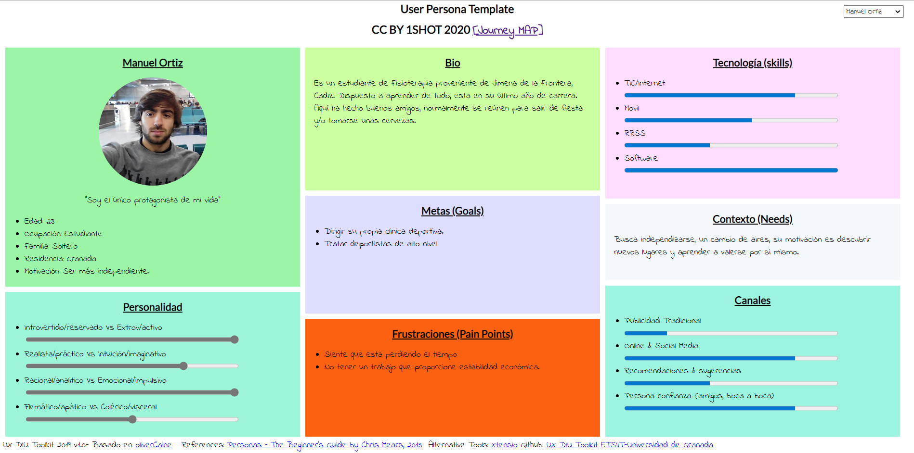
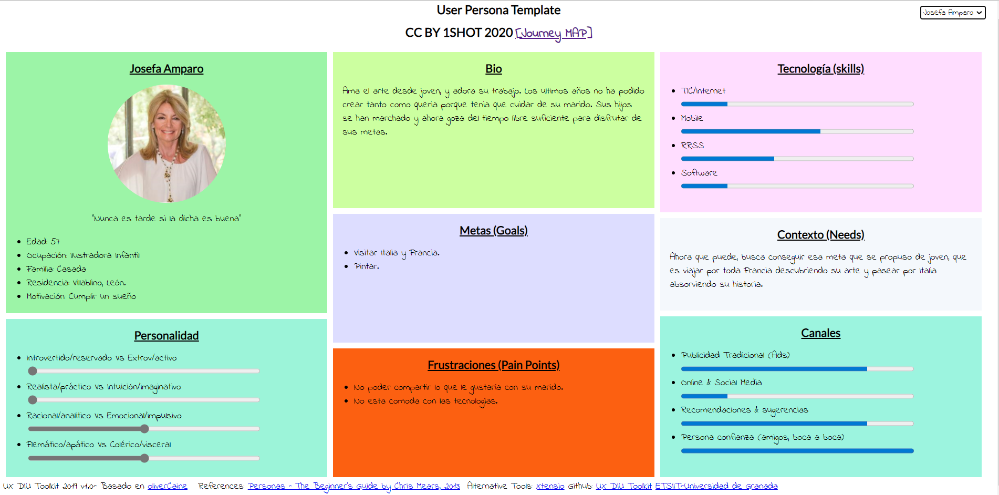

# DIU20
Prácticas Diseño Interfaces de Usuario 2019-20 (Economía Colaborativa) 

Grupo: DIU1_1SHOT.  Curso: 2019/20 

Proyecto:
-----
Nombre de la aplicación: Share to Fly 
Descripción: Aplicación social de viajes compartidos 
Logotipo: Opcionalmente si diseña un logotipo para su producto en la práctica 3 pongalo aqui

Miembros
 * :bust_in_silhouette:  Daniel Matilla Bastero     [:octocat:](https://github.com/Cadiducho)
 * :bust_in_silhouette:  Juan Manuel Rubio Rodríguez     [:octocat:](https://github.com/juanmrr)
 * :bust_in_silhouette:  Paula Ruiz García     [:octocat:](https://github.com/aluruiz)

----- 

# Proceso de Diseño 

## Introducción
Nuestra aplicación asignada ha sido aquella que trata sobre compartir viajes, las cuales son un tipo de aplicación que se está haciendo viral.

En nuestro caso hemos elegido la aplicación Passporter, que ha sido recomendada por diversas personas en plataformas de streaming online y de la que ya teníamos alguna experiencia previa, no tanto de uso como de conocimiento de su existencia y funcionamiento primario. Pretendemos realizar una propuesta de valor sobre esa aplicación y crear una nueva, llamada Share to Fly que, manteniendo el carácter de red social de Passporter aúne la posibilidad de gestionar también los viajes y rutas de los usuarios para ser compartidos.

-----

 Competitive Analysis
----- 
En la mesa había más opciones, como Showaround, una aplicación que más que realizar viajes desde el punto de vista de la economía compartida, se basa en la búsqueda de un guía local que ayude a los usuarios a ver/conocer la ciudad durante su estancia. Permite la interacción entre usuarios tanto para buscar guía como para ofrecerse y la creación de rutas y viajes. No ofrece un soporte como tal para la organización de viajes, es un trabajo que queda para el usuario.

Otra opción estudiada ha sido Travello, una aplicación de eminente carácter social (tiene un asombroso parecido con redes sociales como Instagram), donde cada usuario puede subir sus fotografías y comentarios de sus viajes. Cuenta con numerosas opciones de búsqueda aunque en nuestro caso consideramos que no excesivamente fáciles o intuitivas de usar. Como “red social de viajes” permite la interacción entre usuarios, aunque también percibimos la existencia de numerosos “perfiles falsos”. Cuenta con un único idioma, el inglés, lo cual puede ser un aspecto negativo en función del usuario.

Por último, Amovens es una aplicación que cuenta tanto con soporte móvil como web y que está enfocada a compartir gastos de desplazamientos entre ciudades, generalmente nacionales. Es una aplicación de carácter práctico, sobria y que prioriza la usabilidad por encima del aspecto visual. Carece del aspecto de red social que sí gozan las anteriores, aunque permite la interacción con usuarios para obtener información del trayecto.

User Reseach
-----
En la práctica no se iban a realizar entrevistas con usuarios reales, con lo cual prescindimos de los mapas de empatía y de afinidad y pasamos a directamente a la creación de dos usuarios ficticios que podrían ser dos potenciales usuarios de la aplicación.

Sin embargo, y antes de crear estos usuarios ficticios, asumimos ciertas necesidades que podrían tener:
>>> 	* En general, a la mayoría de la gente le gusta viajar
	* Un gran número de usuarios está familiarizado con una interfaz de red social
	* Dichos usuarios esperan tener un cierto grado de personalización dentro de la aplicación
	* Aparte de compatir sus experiencias, también desean interactuar con otros usuarios, bien para conocer detalles acerca del destino o bien para compartir el viaje o parte del trayecto.

 User Personas
-----
Bajo esas premisas, creamos las fichas de estos dos personajes de tal manera que tuviésemos perfiles de dos tipos de personas con diferentes puntos de vista.
Por una parte tenemos a Manuel Ortiz, un chico joven y emprendedor que busca nuevas metas en su vida, tanto laborales como sociales. Para ello busca observar nuevos ámbitos donde poder tener un cambio de aires.

Por otro lado, tenemos a Josefa Amparo, una señora de mediana edad, de un pequeño pueblo de León, que ahora que tiene tiempo libre quiere aprovechar al máximo sus oportunidades y cumplir un viejo anhelo, viajar a Italia.

 Users Journey Map
----
En primer lugar tenemos la experiencia de un chico joven, que ha vivido prácticamente en la era de la tecnología, y nuestra aplicación le ayuda más a revisar las cosas básicas de cada ciudad o país que busca visitar, tales como lo que cuesta vivir allí, las salidas nocturnas, los sitios de interés… etc. Creemos que este caso es de los más comunes, ya que todos los estudiantes, una vez terminada la carrera, buscan salir al mundo y cambiar de aires. La búsqueda de una independencia económica es una de las razones que más mueven a los jóvenes a salir de su zona de confort y descubrir nuevas formas de ver el mundo.

Y por último, Josefa, una señora que utiliza la aplicación gracias a que sus nietos se la explican y le ayudan a entender un poco el mundo de las nuevas tecnologías. Gracias a ella, podemos ver que la app es sencilla e intuitiva. Con ella, Josefa descubre museos, exposiciones y monumentos espectaculares de todos los lugares que quiere visitar. 

Esta experiencia la consideramos menos habitual dado que las personas de su edad están menos relacionadas con las nuevas tecnologías y el uso de internet.
	

 1.d Usability Review
----
>>>  Revisión de usabilidad: (toma los siguientes documentos de referncia y verifica puntos de verificación de  usabilidad
>>>> SE deben incluir claramente los siguientes elementos
>>> - Enlace al documento:  (sube a github el xls/pdf) 
>>> - Valoración final (numérica): 
>>> - Comentario sobre la valoración:  (60-120 caracteres)

## Paso 2. UX Design  

 2.a Feedback Capture Grid
----

>>> Comenta con un diagrama los aspectos más destacados a modo de conclusion de la práctica anterior,
A tenor de lo estudiado anteriormente sobre la aplicación escogida (en nuestro caso, Passporter), se decide seguir con el perfil de la aplicación eminentemente social, pues aporta un plus al usuario, especialmente enfocado a personas jóvenes y de mediana edad. Además, se permite la realización de rutas y viajes con el objetivo de buscar y encontrar otros usuarios interesados en realizar un mismo viaje y compartir sus gastos.

| Interesante/relevante                                        | Críticas constructivas                                                      |
|--------------------------------------------------------------|-----------------------------------------------------------------------------|
| La página de inicio es clara e intuitiva.                    | No poder contactar con la gente de manera sencilla                          |
| Diversidad a la hora de buscar destinos o lugares concretos. | Una opción de ayuda al cliente                                              |
| Información exhaustiva sobre los destinos                    | No se pueden cambiar las fotos de portada de los viajes                     |
| Es gratuita                                                  | Búsqueda mejorable (adolece de falta de localizaciones)                     |
| Perfil de red social                                         | Se echa en falta poder añadir una descripción por cada fotografía           |

| Preguntas a partir de la experiencia                                    | Nuevas ideas                                                      |
|----------------------------------------------------------------|-------------------------------------------------------------------------------|
| ¿Puedo contactar con gente para viajar?                      | Ofrecer la posibilidad de programar un itinerario/viaje en base a un perfil |
| ¿Puedo contactar con alguien de soporte para que me ayude?   | Implementar una plataforma y/o pasarela para la adquisición del viaje       |
| ¿Puedo buscar un barrio concreto de una ciudad?              | Subir, además de fotografías, videos                                        |
| ¿No hay modos de edición?                                    |                                                                             |

>>> ¿Que planteas como "propuesta de valor" para un nuevo diseño de aplicación para economia colaborativa ?
>>> Problema e hipótesis
>>>  Que planteas como "propuesta de valor" para un nuevo diseño de aplicación para economia colaborativa te
>>> (150-200 caracteres)

 2.b Tasks & Sitemap 
-----
Se va a distinguir esencialmente entre dos grupos de usuarios: logueados y no logueados. Tras un análisis de la funcionalidad de la aplicación, llegamos a la conclusión de que las actividades permitidas a un usuario previamente registrado no varían de forma significativa en función de si pertenece a un grupo social concreto ni es discriminante por edad. Con lo cual vamos a agrupar a los usuarios en “logueados” y “no logueados”.

|                                                            | Usuario logueado | Usuario no logueado |
|------------------------------------------------------------|------------------|---------------------|
| Cambiar el idioma                                          | Medio            | Medio               |
| Subir una fotografía/vídeo al perfil propio                | Alto             | -                   |
| Editar una fotografía/vídeo                                | Medio            | -                   |
| Buscar un destino mediante uno o varios filtros            | Alto             | Alto                |
| Contactar con otro usuario para conocer detalles del viaje | Alto             | -                   |
| Consultar información relativa al destino                  | Alto             | Alto                |
| Crear un viaje al que se puedan unir otros usuarios        | Medio            | -                   |
| Eliminar un viaje del perfil                               | Medio            | -                   |
| Apuntarse/darse de baja a/de un viaje                      | Alto             | -                   |

>>> Definir "User Map" y "Task Flow" ... 

 2.c Labelling 
----

El sitio web se divide en tres grandes ramas: una zona para la búsqueda de destinos así como información relativa a ellos, una zona para la gestión y desarrollo de los viajes (realización y búsqueda de usuarios) y una última zona asociada al perfil propio del usuario en la aplicación donde éste puede gestionar su actividad en el sitio.
Las tres ramas mencionadas anteriormente cuelgan de un Home Page, donde se visualizan los últimos viajes/rutas creadas por usuarios y/o los más populares.

>>> Identificar términos para diálogo con usuario  

| Label                                                                       | Scope Note                                                                                                                                                                                                                                                                                                                                                                                                      |
|-----------------------------------------------------------------------------|-----------------------------------------------------------------------------------------------------------------------------------------------------------------------------------------------------------------------------------------------------------------------------------------------------------------------------------------------------------------------------------------------------------------|
| Home                                                                        | Compuesto por una cabecera que contiene el título de la página y el logotipo, una barra de navegación y, en la esquina superior derecha, el acceso al login del sitio web. También posee un cuerpo principal en el que se mostrarán los viajes más destacados subidos por los usuarios. En la parte superior se mostrará el motor de búsqueda de destinos. El pie de página lleva a la información de contacto. |
| Login                                                                       | Se pide el correo del usuario y su contraseña para identificarse en el sitio. Debajo se ofrece la opción de registrarse en caso de no estarlo.                                                                                                                                                                                                                                                                  |
| Búsqueda por lugar                                                          | Se realiza una búsqueda en el lugar en función de una/s palabra/s clave introducidas por el usuario en relación a un destino.                                                                                                                                                                                                                                                                                   |
| Búsqueda por fecha                                                          | Se realiza una búsqueda de acuerdo al día indicado por el usuario.                                                                                                                                                                                                                                                                                                                                              |
| Búsqueda por categoría                                                      | Se realiza una búsqueda de acuerdo a ciertas características asociadas a destinos como: explorar, chill, noche, dormir y comer.                                                                                                                                                                                                                                                                                 |
| Búsqueda por duración                                                       | Se realiza una búsqueda según la duración que desee el usuario, distinguiendo entre corto (1-2 días), medio (3-6 días) y largo (+7).                                                                                                                                                                                                                                                                            |
| Viajes                                                                      | Muestra los viajes que van a realizarse para que los usuarios se puedan apuntar y realizar un viaje organizado con más gente.                                                                                                                                                                                                                                                                                   |
| Info                                                                        | Información sobre el viaje a realizar. (Días, lugar, excursiones...etc)                                          |   
| Usuarios                                                                    | Usuarios que ya se han apuntado al viaje. Además, tiene la opción de contactar con los creadores para exponer dudas. |                                                                           
| Apuntarse                                                                   | Formulario para apuntarse al viaje, además te da la información del precio que cuesta en ese momento y las opciones de vuelos y alojamientos.                                                                                                                                                                                                                                                                   |
| Perfil                                                                      | Corresponde al sitio personal del usuario. Se muestran imágenes de los viajes ya realizados, y aquellos a los que se ha apuntado. Tiene carácter de red social. Se pueden subir fotografías y vídeos con sus respectivas descripciones.                                                                                                                                                                         |
| Contacto                                                                    | Se ofrece un formulario para contactar con el administrador del lugar en caso de duda y/o problema relacionado con el sitio web.                                                                                                                                                                                                                                                                                |

 2.d Wireframes
-----

>>> Plantear el  diseño del layout para Web/movil (organización y simulación ) 

## Paso 3. Mi equipo UX-Case Study 

 3.a ¿Como se cuenta un UX-Case Study?
-----

>>> Analizar lo aprendido de la experiencia MuseApp 

  3.b Logotipo
----

>>> Si diseña un logotipo, explique la herramienta utilizada y la resolución empleada. ¿Puede usar esta imagen como cabecera de Twitter, por ejemplo, o necesita otra?

 3.c Guidelines
----

>>> Tras documentarse, muestre las deciones tomadas sobre Patrones IU a usar para la fase siguiente de prototipado. 

  3.d Video
----

>>> Documente y resuma el diseño de su producto en forma de video de 90 segundos aprox

## Paso 4. Evaluación 

 4.a Casos asignados
----

>>> Descripción de las asignaciones (3 UX Case Study) y enlace a  sus repositorios.

>>>> En la seccioón P4/readme.md se debe acceder además a sus respectivas hojas de evaluación y conclusiones 

 4.b User Testing
----

>>> Seleccione a una de sus personas ficticias. Exprese las ideas de posibles situaciones conflictivas de esa persona en las propuestas evaluadas

. 4.c Ranking 
----

>>> Concluya con un ranking de los casos evaluados 

>>> Valoración personal 

## Paso 5. Evaluación de Accesibilidad  

  5.a Accesibility evaluation Report
----

>>> Indica qué pretendes evaluar (de accesibilidad) y qué resultados has obtenido + Valoración personal

>>> Evaluación de la Accesibilidad (con simuladores o verificación de WACG) 

## Conclusión final / Valoración de las prácticas

>>> (90-150 palabras) Opinión del proceso de desarrollo de diseño siguiendo metodología UX y valoración (positiva /negativa) de los resultados obtenidos  

